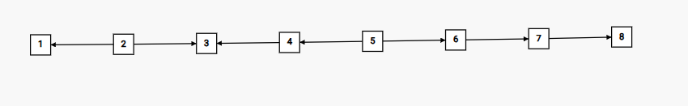

## 2131A. Lever

### 题意

有数组 $a, b$，长度为 $n$。现在循环进行操作，每次操作包含两步：

- 选择一个 $1 \leq i \leq n$ 且 $a_i > b_i$，然后使 $a_i$ 减少 $1$；若没有这样的 $i$，则忽略这一步。
- 选择一个 $1 \leq i \leq n$ 且 $a_i < b_i$，然后使 $a_i$ 增加 $1$；若没有这样的 $i$，则忽略这一步。

若在某次操作中，步骤 $1$ 被忽略了，则终止循环。

请问循环将会执行多少次？题目保证在任意一步中，对于所有可供选择的 $i$，不论选择哪个 $i$ 都不影响最终答案。

### 题解

目力惊人的我们发现，步骤 $2$ 不会影响步骤 $1$。

**证明**：对于某次操作中没有被忽略的步骤 $2$，选择的下标为 $i$，由于 $a_i < b_i$，可得 $a'_i \leq b_i$。因此，操作后的 $i$ 不可能被步骤 $1$ 选择，即步骤 $2$ 不影响步骤 $1$。

对于每个 $i$，操作 $1$ 至多可以执行 $\max(a_i - b_i, 0)$ 次。

遍历每个 $i$，累加操作 $1$ 的次数，最后加上 $1$（被忽略的那一次）即为答案。

### 参考代码

[Submission #333289337](https://codeforces.com/contest/2131/submission/333289337)

## 2131B. Alternating Series

### 题意

定义长度为 $n$ 的数组 $a$ 是**好的**当且仅当：

1. 对于每个 $1 \leq i \le n$，$a_i \times a_{i + 1} \le 0$；
2. 所有长度为 $2$ 以上的子数组的元素之和都为正。

定义**好的**数组 $a$ 比另一个**好的**数组 $b$ **更好**当且仅当 $[|a_1|, |a_2|, \ldots, |a_n|]$ 比 $[|b_1|, |b_2|, \ldots, |b_n|]$ 的字典序更小。

输出一个长度为 $n$ 的**好的**数组，使其比所有长度为 $n$ 的**好的**数组**更好**。

### 题解

> 这题完全可以找规律做

注意到**好的**数组满足：
1. 符号交替出现；
2. 所有长度为 $2$ 以上的子数组的元素之和都为正。

**证明**：

考虑子数组 $[a_{i - 1}, a_i, a_{i + 1}]$，其中 $2 \leq i \leq n - 1$。根据符号交替性：

$$a_{i - 1} + a_i + a_{i + 1} \leq -1 + a_i - 1 = a_i - 2$$

而根据题目要求 $a_{i - 1} + a_i + a_{i + 1} \geq 1$ 可得：

$$a_i \geq 3$$

对于边界情况 $i = n$，同理易得 $a_i \geq 2$。

综上可得数组构造方法：

- 对于奇数下标，取 $a_i = -1$
- 对于偶数下标
    - 当 $2 \leq i \leq n - 1$ 时，有 $a_i \geq 3$，为了绝对值字典序最小，取 $3$。
    - 当 $i = n$ 时，有 $a_i \geq 2$，同理取 $2$。

**正确性证明**：
1. 符号交替性显然满足
2. 对于任意长度 $k \geq 2$ 的子数组 $s$：
    - 当 $k = 2$ 时：由一个 $2$ 或 $3$ 与一个 $-1$ 组成，$\sum s \geq 2 - 1 = 1$；
    - 当 $k = 3$ 时：
        - $[3, -1, (2 or 3)]$，$\sum s \geq 3 - 1 + 2 = 4$，
        - $[-1, 3, -1]$，$\sum s \geq -1 + 3 - 1 = 1$；
    - 当 $k \geq 4$ 时：可以看作多个子数组的和，为正。

### 参考代码

[Submission #333498392](https://codeforces.com/contest/2131/submission/333498392)

## 2131C. Make it Equal

### 题意

给定两个可重集合 $S$ 和 $T$，可以对 $S$ 中任意一个元素 $x$ 进行操作：将 $S$ 中的一个 $x$ 替换为 $x + k$ 或 $|x - k|$。

请问是否可以将 $S$ 变化为 $T$？

### 题解

容易证明：我们只能将元素 $x$ 替换为 $y$ 当且仅当 $x \equiv y (\bmod k)$ 或 $x \equiv -y (\bmod k)$。

实现：存储 $S_i \bmod k$ 与 $-S_i \bmod k$ 中较小的一个，比较两集合经过这样处理后的新集合是否相同即可。

### 参考代码

[Submission #333526673](https://codeforces.com/contest/2131/submission/333526673)

## 2131D. Arboris Contractio

### 题意

有一棵拥有 $n$ 个节点的树，你希望尽可能地缩小它的[直径](https://oi-wiki.org/graph/tree-diameter/)。为了缩小直径，你可以对这棵树进行若干次操作：

1. 选择两个树上的节点 $s$ 和 $t$；
2. 删除这两个节点简单路径上的所有边；
3. 连接 $s$ 和简单路径上的除 $s$ 外的所有节点。

容易证明每次操作后，这张图还是树。

请问：最少进行多少次操作，使得树的直径最小化？

### 题解

容易发现：

1. 分类讨论
    - 对于 $n \leq 3$ 的树，不需要操作
        - $n = 1$，直径为 $0$，是最小值
        - $n = 2$，直径为 $1$，是最小值
        - $n = 3$，直径为 $2$，是最小值
    - 对于 $n > 3$ 的树，树的直径最小值为 $2$
        - 直径为 $1$ 意味着树中最长简单路径上只有 $2$ 个节点，在 $n > 3$ 条件下，不可能存在
2. 操作的作用在于使某条简单路径上的所有点与简单路径某一端点**直接**相连

稍加推导即可得到关键结论：

1. 我们应该选择一个固定的节点作为根节点，然后使其作为 $s$ 参与每次操作。
2. 树的直径是 $2$ 的充要条件是叶节点的深度全为 $1$。

证明关键结论2：

- 必要性（如果树的直径是 $2$，那么所有叶节点的深度必须是 $1$）
    1. 假设树的直径是 $2$，这意味着树中最长的简单路径包含 $3$ 个节点（路径长度为 $2$）。
    1. 如果存在一个叶节点 $u$，其深度大于 $1$，那么它至少通过一个中间节点连接到根节点。
    1. 由于树的结构，这个叶节点 $u$ 到根节点的距离大于 $1$，即路径长度至少为 $2$。
    1. 同时，因为 $u$ 是叶节点，它没有其他子节点，所以从 $u$ 出发的最长路径只能回到它的父节点，再延伸到根节点。
    1. 由于 $n > 3$，所以这条路径可以延伸到其它连接到根的节点。
    1. 这样会导致存在一条路径长度大于 $2$，与“直径为 $2$”矛盾。
    1. 因此，若树的直径为 $2$，所有叶节点必须直接连接到根节点，即深度为 $1$。
- 充分性（如果所有叶节点的深度都是 $1$，那么树的直径是 $2$）
    1. 假设所有叶节点的深度都是 $1$，即它们都直接与根节点相连。
    1. 那么树的结构是以根为中心的星形结构，所有叶节点都连接在根上。
    1. 在这种结构中，任意两个节点之间的最长路径是从一个叶节点到根再到另一个叶节点，路径长度为 $2$。
    1. 因此，树的直径为 $2$。

因此，我们每次选择一个深度非 $1$ 的叶节点进行操作即可。容易证明，这样的操作只会使一个叶节点的深度从非 $1$ 变为 $1$。

那么，如何选择最佳的根节点呢？

由于无论选择怎样的 $root$，我们都是对所有深度非 $1$ 的叶节点逐个做一次操作，因此，我们只需统计所有深度非 $1$ 的叶节点的个数（记作 $ans$）即可。

显而易见地，我们有：（$cnt_0$ 表示叶节点总个数，$cnt_{root}$ 表示直接连接 $root$ 的叶节点个数）

$$ ans = cnt_0 - cnt_{root} $$

- $cnt_0$ 可以通过数节点的度数来 $O(n)$ 地计算；
- $cnt_{root}$ 通过 $root$ 连接的每个点的度数来计算，由于树的边数性质，复杂度为 $O(n)$。

### 参考代码

[Submission #333756238](https://codeforces.com/contest/2131/submission/333756238)

## 2131E. Adjacent XOR

### 题意

有一个长度为 $n$ 的数组 $a$。你可以对每个 $1 \leq i < n$ 做**至多一次**操作：

- 将 $a_i$ 改为 $a_i \oplus a_{i + 1}$。

其中，$\oplus$ 表示[异或运算](https://oi-wiki.org/math/bit/#%E4%B8%8E%E6%88%96%E5%BC%82%E6%88%96)。

请问能否将 $a$ 变为 $b$？

### 题解

若 $a_n \neq b_n$，则完全不可能。

考虑 $a_i$ 与 $a_{i + 1}$，在以下情况下是可以使 $a_i$ 变为 $b_i$ 的：

- $a_i = b_i$，不用操作。
- $a_i \oplus a_{i + 1} = b_i$，先操作 $a_i$，再决定要不要操作 $a_{i + 1}$。
- $a_i \oplus b_{i + 1} = b_i$，先决定要不要操作 $a_{i + 1}$，再操作 $a_i$。

容易发现，如果将每个 $a_i$ 与 $a_{i + 1}$ 的操作顺序连边，构成的图必定是[有向无环](https://oi-wiki.org/graph/dag/)的，或者说我们构建了一个[AOV网](https://oi-wiki.org/graph/topo/#aov-%E7%BD%91)。

例如以下样例：

```plain
n = 8
a = [3, 3, 5, 5, 0, 3, 3, 6]
b = [5, 6, 3, 6, 3, 0, 5, 6]
EXPECTED = YES
```

构建出的图是这样的：



因此，构成的图是可以[拓扑排序](https://oi-wiki.org/graph/topo/)的，即必定存在一种方案可以完成全部需要完成的操作。

结论：只要对于所有 $1 \leq i < n$，都有以下三个条件之一为真：

- $a_i = b_i$
- $a_i \oplus a_{i + 1} = b_i$
- $a_i \oplus b_{i + 1} = b_i$

那么就可以将 $a$ 转变为 $b$。

### 参考代码

[Submission #333464914](https://codeforces.com/contest/2131/submission/333464914)
