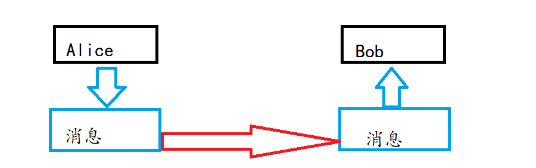
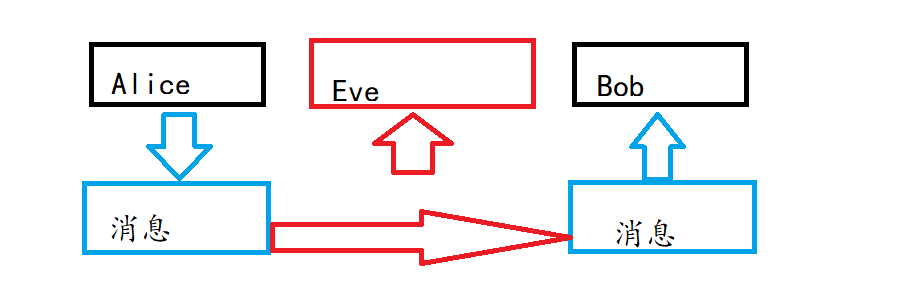
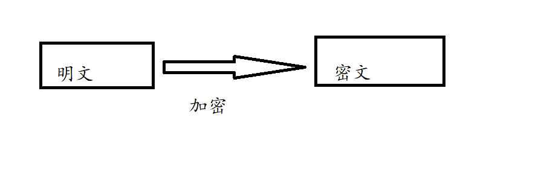
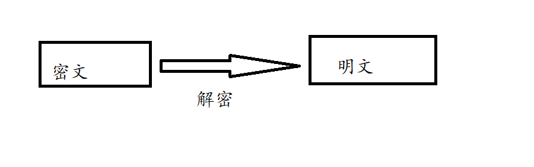
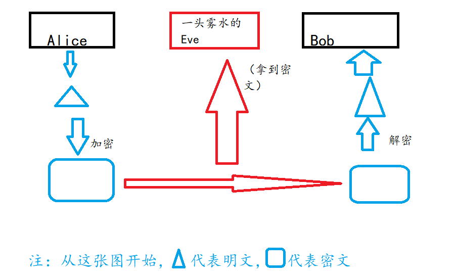

## 窃听

发送者（sender）Alice向接收者（receiver）Bob发信息（message）。

但是可能有窃听者（eavesdropper）会偷看消息。

## 加密解密

加密（encrypt）的过程就是将明文（plaintext）转化为密文（ciphertext）的过程，而解密（decrypt）相反。

如果将消息加密发送，窃听者得到的只有密文。

## 机密性

在刚刚的故事里，Alice和Bob运用了密码技术（cryptography），保证了信息的机密性（confidentiality）。

## 破译密码

通过非正当的手段试图把密文还原成明文叫做密码破译（cryptanalysis），简称破译，也称为密码分析。

进行破译的人叫做破译者（cryptanalyst）。