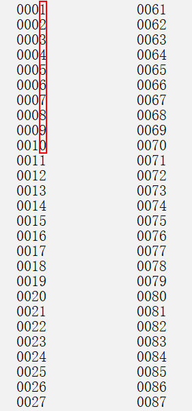

## 问题

$[0, n)$ 中的数的数位和的和是多少？

保证：$n = p \times 10^q$，$p, q$ 为正整数。即 $n$ 是 $x999\dots$ 的形式。

例如：$[0, 20)$ 中数的数位和的和是 $0 + 1 + 2 + 3 + \dots + 9 + (1 + 0) + (1 + 1) + (1 + 2) + \dots + (1 + 9) = 100$。

## 用数学期望算

将 $n$ 这个数的首位和其他位分开，记 $n$ 的位数为 $l$。

假设所有在原区间内地数都是 $l$ 位的，若不足 $l$ 位的数，在前面补 $0$。这一操作并不影响结果。

先讨论除首位外的其他位，观察上图我们发现，这些位的值在 $0$ 到 $9$ 之间**均匀地**分布，所以可以计算每一位的数学期望为 $4.5$。又因为统计数位和的区间包括了 $n$ 个数，总共存在 $n \times (l - 1)$ 个数位，所以这一部分的数位和为 $4.5 \times n \times (l - 1)$。

再讨论首位，设首位值为 $d_1$，相似地，可以证明第一位的值在 $0$ 到 $d_1$ 之间均匀分布，所以首位数学期望为 $\frac{d_1}{2}$。因此首位数位和为 $\frac{d_1}{2} \times n$。

上面两式相加即为 $[0, n)$ 中数的数位和的和。
