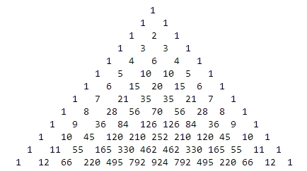

## 分数版杨辉三角

比如说像：

```
       1/4
    1/4   1/4
1/4    2/4   1/4
...
```

这一类的。

我们已知它的特性有：

- 一行的和是上一行的2倍（不含第一行）
- 一个数是上面两个数的和（没有一个就等于另一个，第一个除外）

其实还可以发现更多。

## 杨辉三角

### 科普一下

杨辉三角，是二项式系数在三角形中的一种几何排列，中国南宋数学家杨辉1261年所著的《详解九章算法》一书中出现。在欧洲，帕斯卡（1623----1662）在1654年发现这一规律，所以这个表又叫做帕斯卡三角形。帕斯卡的发现比杨辉要迟393年，比贾宪迟600年。

杨辉三角是中国数学史上的一个伟大成就。

| 科普一下 |  |
| ----- | ----- |
| 中文名 | 杨辉三角 |
| 外文名 | Pascal's Triangle |
| 别名 | 贾宪三角形、帕斯卡三角形 |
| 提出时间 | 约1050年 |
| 发现者 | 杨辉 |



### 用途及其特性

- 每个数等于它上方两数之和。
- 每行数字左右对称，由$1$开始逐渐变大。
- 第$n$行的数字有$n$项。
- 前$n$行共$\frac{(1+n)n}{2}$个数。
- 第$n$行的$m$个数可表示为$C_{n-1}^{m-1}$，即为从$n-1$个不同元素中取$m-1$个元素的组合数。
- 第n行数字的和为$2^{n-1}$。
$$1=2^{1-1}$$
$$1+1=2^{2-1}$$
$$1+2+1=2^{3-1}$$
$$1+3+3+1=2^{4-1}$$
$$1+4+6+4+1=2^{5-1}$$
$$1+5+10+10+5+1=2^{6-1}$$
- 斜线上数字的和等于其向左（从左上方到右下方的斜线）或向右拐弯（从右上方到左下方的斜线），拐角上的数字。
$$1+1=2$$
$$1+1+1=3$$
$$1+1+1+1=4$$
$$1+2=3$$
$$1+2+3=6$$
$$1+2+3+4=10$$
$$1+3=4$$
$$1+3+6=10$$
$$1+4=5$$
- 将各行数字左对齐，其右上到左下对角线数字的和等于斐波那契数列的数字。
$$1$$
$$1$$
$$1+1=2$$
$$2+1=3$$
$$1+3+1=5$$
$$3+4+1=8$$
$$1+6+5+1=13$$
$$4+10+6+1=21$$
$$1+10+15+7+1=34$$
$$5+20+21+8+1=55$$
